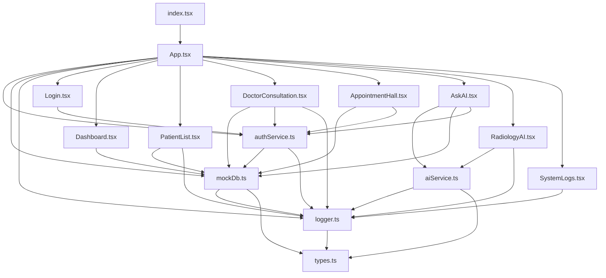

# MedData Hub - 前端架构与逻辑详细说明书

本文档详细描述了 MedData Hub 前端项目的代码结构、各文件功能逻辑以及组件之间的调用关系。

---

## 1. 系统架构概览 (System Architecture)

本项目基于 **React 19** + **TypeScript** 构建，采用 **单页应用 (SPA)** 模式。

### 核心设计模式
1.  **混合数据层 (Hybrid Data Layer)**: 系统设计了 `mockDb.ts` 作为统一数据接口。它既支持纯前端的 **Mock 模式** (利用 `localStorage` 持久化)，也支持通过 `fetch` 连接真实的 Python 后端 (**API 模式**)。前端组件对此无感知，只调用统一的 Promise 方法。
2.  **角色访问控制 (RBAC)**: 通过 `authService.ts` 管理 Session，结合 `App.tsx` 中的路由守卫 (`RequireAuth`)，实现了 **患者 (Patient)**、**医生 (Doctor)**、**管理员 (Admin)** 三种角色的权限隔离。
3.  **统一 AI 网关**: `aiService.ts` 封装了不同厂商 (Gemini, OpenAI, DeepSeek) 的 API 差异，向 UI 组件提供统一的 `chatWithAI` 和 `analyzeMedicalImage` 接口。

---

## 2. 核心服务层逻辑详解 (Core Services)

位于 `src/services/` 目录，负责数据处理、认证与外部接口通信。

### `src/services/mockDb.ts` (数据主脑)
*   **功能**: 全局数据访问层 (DAL)，处理所有 CRUD 请求。
*   **详细逻辑**:
    *   **混合请求策略 (`fetchWithFallback`)**: 所有的 GET 请求都会先尝试连接后端 API (`http://localhost:5000`)。如果请求超时 (3秒) 或失败 (网络错误/404)，自动捕获异常并返回预定义的 `MockData`，同时在 `localStorage` 中查找是否有缓存数据。
    *   **写操作双写**: `createPatient`, `saveMedicalRecord` 等写操作会先更新 `localStorage` 以保证 Mock 模式下的演示数据持久化，随后**异步**发送真实 HTTP 请求给后端。这样即使后端离线，前端 UI 也能即时响应成功。
    *   **数据一致性**: `getExistingPatient` 是一个关键函数，用于医生接诊前。它会强制从后端拉取最新的患者列表 (跳过缓存)，严格校验挂号单中的 Patient ID 是否有效，防止脏数据导致诊疗错误。
*   **依赖**: `types.ts`, `logger.ts`
*   **被调用**: 几乎所有 UI 组件。

### `src/services/authService.ts` (认证中心)
*   **功能**: 用户登录、注册、注销及 Session 管理。
*   **详细逻辑**:
    *   **登录流程 (`login`)**: 首先调用 `mockDb.loginUser` 尝试真实后端验证。如果后端不可用，进入 Mock 验证逻辑：检查 `admin/admin` 或在 `mockDb` 的医生/患者列表中查找 ID 匹配项。
    *   **Session 持久化**: 登录成功后将用户信息 (`UserSession`) 序列化存储到 `localStorage` 的 `meddata_user_session` 字段。
    *   **调试模式**: 提供 `setDebugMode`，用于开启系统日志的 UI 入口。
*   **依赖**: `mockDb.ts`, `types.ts`, `logger.ts`
*   **被调用**: `Login.tsx`, `App.tsx` (路由守卫), `DoctorConsultation.tsx` (获取当前医生ID)。

### `src/services/aiService.ts` (AI 网关)
*   **功能**: 统一的大模型调用接口。
*   **详细逻辑**:
    *   **多厂商适配**: 定义了 `DEFAULT_CONFIGS`。`chatWithAI` 函数根据配置的 `provider` (Gemini, DeepSeek, OpenAI, Doubao) 选择调用策略。Gemini 使用 `@google/genai` SDK，其他厂商使用原生 `fetch` 适配 OpenAI 兼容格式 (`/chat/completions`)。
    *   **RAG 上下文注入**: 函数接收 `contextData` 参数，将其封装在 System Prompt 中，指示 AI "基于以下 JSON 数据回答"，从而实现基于数据库事实的问答。
    *   **视觉分析**: `analyzeMedicalImage` 负责处理 Base64 图片，Gemini 使用 `inlineData` 格式，GPT-4o 使用 `image_url` 格式。
*   **依赖**: `@google/genai`, `logger.ts`, `types.ts`
*   **被调用**: `AskAI.tsx`, `RadiologyAI.tsx`

### `src/services/logger.ts` (日志系统)
*   **功能**: 前端全链路埋点系统。
*   **详细逻辑**:
    *   **存储策略**: 调用 `addLog` 时，将日志对象插入 `localStorage` 数组头部。
    *   **容量保护**: 每次写入前截断数组，仅保留最新的 200 条日志。针对过大的 `metadata` (如 API 响应体)，执行字符串截断，防止 `QuotaExceededError`。
*   **被调用**: 全局所有文件。

---

## 3. UI 组件层逻辑详解 (Components)

### `src/App.tsx` (根组件)
*   **功能**: 路由配置、全局布局、权限守卫。
*   **详细逻辑**:
    *   **Layout**: 包含侧边栏 (`Sidebar`) 和顶部 Header。侧边栏通过检查 `user.role` 动态决定渲染哪些菜单项 (如患者看不到医生工作台)。
    *   **RequireAuth**: 高阶组件。渲染路由前检查 `authService.getCurrentUser()`，若为空重定向至 `/login`。同时检查 `roles` 数组，防止越权访问。
    *   **Backend Health**: 使用 `useEffect` 调用 `mockDb.checkBackendHealth`，实时控制 Header 上的 "DB Connected" 状态灯。
*   **依赖**: `authService`, `mockDb`, 所有页面组件。

### `src/components/DoctorConsultation.tsx` (核心业务 - 医生工作台)
*   **功能**: 医生接诊、写病历、开处方；管理员监控大屏。
*   **详细逻辑**:
    *   **视图路由**: 根据登录角色判断。如果是 Admin，渲染全院挂号统计图表 (Recharts)；如果是 Doctor，渲染接诊界面。
    *   **队列轮询**: 使用 `setInterval` 每 10 秒调用 `loadQueueOnly`，自动刷新候诊列表。
    *   **接诊事务**:
        1.  **叫号**: 从队列中取出第一位 (`activeQueue[0]`)。
        2.  **校验**: 调用 `getExistingPatient` 确保患者档案存在。
        3.  **锁定**: 设置 `currentAppointment` 状态，界面切换为病历编辑模式。
    *   **提交**: 用户点击"完成诊疗"后，使用 `Promise.all` 并行执行：
        1.  `saveMedicalRecord`: 保存病历和处方。
        2.  `updateAppointmentStatus`: 将挂号单状态更为 `completed`。
*   **依赖**: `mockDb`, `authService`, `logger`, `types`

### `src/components/AppointmentHall.tsx` (挂号大厅)
*   **功能**: 患者自助挂号表单。
*   **详细逻辑**:
    *   **自动填充**: 初始化时检查 `user.role`。如果是患者，自动调用 `findPatientByQuery` 填入姓名/电话并禁用输入框，防止替人挂号。
    *   **数据流**: 收集表单 -> `createAppointment` -> 发送给后端 (状态为 `pending`)。
*   **依赖**: `mockDb`, `authService`

### `src/components/PatientList.tsx` (档案管理)
*   **功能**: 患者 CRUD。
*   **详细逻辑**:
    *   **模态框**: 使用 `createPortal` 将新增/编辑窗口挂载到 `document.body`，确保层级最高。
    *   **操作**: 新增调用 `createPatient`，编辑调用 `updatePatient`。支持本地搜索过滤。
*   **依赖**: `mockDb`, `logger`

### `src/components/AskAI.tsx` (智能问答)
*   **功能**: RAG 对话界面。
*   **详细逻辑**:
    *   **上下文构建**: 用户发送消息前，并行调用 `getPatients`, `getDoctors`, `getMedicines` 等接口获取当前数据库快照。
    *   **Prompt 注入**: 根据当前用户角色 (Patient/Doctor/Admin) 生成不同的 System Persona (如"你是导诊护士" vs "你是临床助手")。
    *   **调用**: 将 `Prompt + JSON Context + User Query` 发送给 `aiService`。
*   **依赖**: `aiService`, `mockDb`, `authService`

### `src/components/RadiologyAI.tsx` (影像诊断)
*   **功能**: 图片上传与 AI 分析。
*   **详细逻辑**:
    *   **文件处理**: 使用 `FileReader` 将上传图片转为 Base64 字符串。
    *   **配置**: 允许用户在 UI 临时修改 API Key。
    *   **调用**: `analyzeMedicalImage` 发送 Base64 给大模型。
*   **依赖**: `aiService`

### `src/components/Dashboard.tsx` & `PatientStats.tsx`
*   **功能**: 统计图表。
*   **详细逻辑**:
    *   **数据计算**: 调用 `mockDb.getStats()`。该函数在 Service 层完成了数据的聚合 (如计算各科室挂号数、药品库存预警)，组件只负责使用 `Recharts` 渲染。
*   **依赖**: `mockDb`

### `src/components/SystemLogs.tsx`
*   **功能**: 日志监控台。
*   **详细逻辑**:
    *   **自动刷新**: `setInterval` 定期读取 `localStorage`。
    *   **详情透视**: 点击日志行，弹窗显示完整的 `metadata` JSON (如 API 请求体)，方便调试 Mock 与 API 的差异。
*   **依赖**: `logger`

### `src/components/Login.tsx`
*   **功能**: 登录与注册。
*   **详细逻辑**:
    *   **注册**: `registerPatient` 成功后自动填充 ID 到登录框。
    *   **登录**: 调用 `authService.login`，成功后使用 `navigate` 跳转到对应角色的首页，并强制 `window.location.reload()` 以刷新 Sidebar 状态。
*   **依赖**: `authService`

---

## 4. 文件间调用关系图 (Dependency Graph)

以下展示了核心模块之间的引用方向 (-> 表示 "依赖于" 或 "调用")。

*注：`types.ts` 被几乎所有文件引用，未在图种完全连线以保持清晰。*
