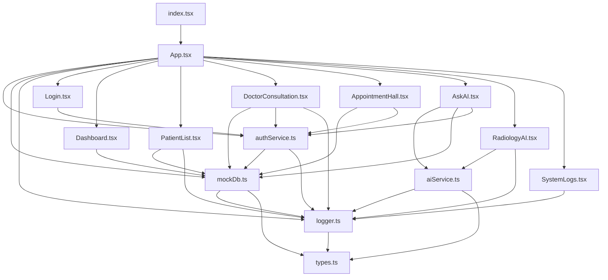

# MedData Hub - 前端架构与逻辑详细说明书

本文档详细描述了 MedData Hub 前端项目的代码结构、各文件功能逻辑以及组件之间的调用关系。

---

## 1. 系统架构概览 (System Architecture)

本项目基于 **React 19** + **TypeScript** 构建，采用 **单页应用 (SPA)** 模式。

### 核心设计模式
1.  **混合数据层 (Hybrid Data Layer)**: 系统设计了 `mockDb.ts` 作为统一数据接口。它既支持纯前端的 **Mock 模式** (利用 `localStorage` 持久化)，也支持通过 `fetch` 连接真实的 Python 后端 (**API 模式**)。前端组件对此无感知，只调用统一的 Promise 方法。
2.  **角色访问控制 (RBAC)**: 通过 `authService.ts` 管理 Session，结合 `App.tsx` 中的路由守卫 (`RequireAuth`)，实现了 **患者 (Patient)**、**医生 (Doctor)**、**管理员 (Admin)** 三种角色的权限隔离。
3.  **统一 AI 网关**: `aiService.ts` 封装了不同厂商 (Gemini, OpenAI, DeepSeek) 的 API 差异，向 UI 组件提供统一的 `chatWithAI` 和 `analyzeMedicalImage` 接口。

---

## 2. 核心服务层逻辑详解 (Core Services)

位于 `services/` 目录，负责数据处理、认证与外部接口通信。

### `services/mockDb.ts`（数据访问层 / API 客户端）

#### **功能**

*   **统一数据访问接口**：作为前端应用与后端服务器之间的唯一桥梁，封装了所有的 HTTP 请求。
*   **混合模式（Hybrid API Strategy）**：采用“API 优先，Mock 兜底”的策略。优先尝试请求真实的后端 API (`http://localhost:5000`)，如果网络请求失败或后端未启动，自动降级返回本地预置的模拟数据（Mock Data），确保演示环境的高可用性。
*   **本地持久化模拟**：在 Mock 模式下，利用 `localStorage` 模拟数据库的持久化操作（增删改），保证在无后端的情况下，用户刷新页面后数据依然保留。
*   **请求日志审计**：集成了日志服务，自动记录所有 API 请求的发起、成功响应或失败回退，便于调试和系统监控。
*   **复杂业务逻辑处理**：不仅负责简单的 CRUD，还处理如“病历-处方关联查询”、“数据聚合统计”、“患者查找”等前端业务逻辑。

#### **核心机制：`fetchWithFallback`**

这是该文件的灵魂函数。其工作流程如下：
1.  **发起请求**：向 `API_BASE_URL` 发起带有超时控制（AbortController）的真实 `fetch` 请求。
2.  **记录日志**：调用 `addLog` 记录请求发起的详细信息（URL、Method）。
3.  **成功处理**：若后端返回 200 OK，记录成功日志并返回真实数据。
4.  **失败回退**：若请求超时、网络断开或服务器 500，捕获异常，记录警告日志，并直接返回传入的 `fallbackData`（本地 Mock 数据或 LocalStorage 数据）。

#### **主要模块与逻辑**

1.  **基础配置与辅助**：
    *   定义了所有实体（患者、医生、药品等）的初始静态 Mock 数据。
    *   提供 `getLocalDatetime` 等时间格式化工具。

2.  **认证服务**：
    *   `loginUser`：发送登录请求，记录敏感操作日志。若后端不可用，抛出异常（认证通常不走 Mock 兜底，以确保安全逻辑）。

3.  **实体 CRUD (患者/医生/药品/科室)**：
    *   实现了标准的 `get`, `create`, `update`, `delete` 方法。
    *   **逻辑**：在发送 API 请求的同时，同步更新 `localStorage` 中的数据副本，确保 UI 在 API 失败回退时能看到最新的操作结果（乐观更新）。

4.  **病历与处方管理**：
    *   `saveMedicalRecord`：处理复杂的事务性操作。接收病历主表和处方明细列表，组装成后端需要的复合 JSON 对象进行提交。
    *   `getFullPatientDetails`：前端“联表查询”逻辑。获取患者的所有病历，并遍历每个病历的处方 ID，去药品表中查找药品名称、价格等详细信息，组装成完整的视图数据。

5.  **多模态数据管理**：
    *   `createMultimodalData`：处理 `FormData` 文件上传。在 Mock 模式下，使用 `URL.createObjectURL` 生成本地 Blob 链接以支持即时预览。

6.  **挂号与流程业务**：
    *   `getAppointments`：支持按医生、日期、患者 ID 或角色进行多维度筛选。
    *   `getExistingPatient`：在医生叫号时，根据挂号单中的 PatientID 或电话号码，反向查找并验证患者档案是否存在。

7.  **统计与报表**：
    *   `getStats` / `getPatientDemographics`：聚合函数。并行获取多个数据源（患者、记录、医生等），在前端计算性别分布、年龄分布、科室排名等统计数据（当后端接口不可用时）。
    *   `getMonthlyStatistics` / `getSankeyData`：获取特定的大屏可视化数据。

#### **关键函数签名**

*   `fetchWithFallback<T>(endpoint: string, fallbackData: T): Promise<T>`
*   `saveMedicalRecord(record: MedicalRecord, details: PrescriptionDetail[])`
*   `getFullPatientDetails(patientId: string)`
*   `getExistingPatient(appointment: Appointment): Promise<Patient>`

#### **依赖**

*   **`types`**：引用了系统中所有的 TypeScript 类型定义。
*   **`logger`**：依赖 `addLog` 函数进行全链路的请求追踪。

### `services/authService.ts`（认证与鉴权服务）

#### **功能**

*   **多模式身份验证**：负责处理管理员、医生和患者的登录逻辑，支持“后端 API 验证优先，本地 Mock 数据验证兜底”的混合策略。
*   **会话管理**：管理用户登录状态（Session），负责将会话信息写入 `localStorage` 以及执行登出时的清除操作。
*   **患者注册**：处理新患者的注册流程，包含数据校验、ID 生成、查重以及调用底层存储接口。
*   **调试状态管理**：控制全局 Debug 模式的开启与关闭，影响系统日志的可见性。
*   **日志审计**：记录所有登录、注册和登出操作的成功或失败状态，作为安全审计的一部分。

#### **逻辑**

1.  **登录流程 (`login`)**：
    *   **步骤一：API 验证**。首先调用 `mockDb.loginUser` 尝试通过真实后端验证。如果成功，构建 Session 对象并持久化，直接返回。
    *   **步骤二：Mock 兜底**。如果后端请求失败（非密码错误，而是网络或服务不可用），则降级进入本地验证流程：
        *   **管理员**：硬编码校验 `admin` / `admin123`。
        *   **医生/患者**：调用 `mockDb` 获取本地缓存的医生或患者列表，匹配 ID 和密码（默认密码通常为 'password'）。

2.  **注册流程 (`registerPatient`)**：
    *   校验必填字段（姓名、手机、密码）。
    *   **手机号查重**：获取现有患者列表，检查手机号是否已存在。
    *   **构建实体**：生成唯一 ID（`P` + 时间戳后4位），设置默认值（如性别、注册时间）。
    *   **持久化**：调用 `createPatient` 将新用户写入 Mock DB（触发 API 请求和本地缓存更新）。

3.  **会话持久化**：
    *   使用 `localStorage` 存储键为 `meddata_user_session` 的 JSON 字符串，包含 `id`, `name`, `role` 和可能的 `token`。

#### **核心函数名称与作用**

1.  **`login`**：
    *   核心认证函数，封装了 API 请求和 Mock 回退逻辑。

2.  **`registerPatient`**：
    *   处理患者注册业务逻辑。

3.  **`logout`**：
    *   清除本地会话数据，记录登出日志。

4.  **`getCurrentUser`**：
    *   同步获取当前登录用户信息，是前端组件判断权限（如 `isAdmin`）的主要依据。

5.  **`setDebugMode` / `isDebugMode`**：
    *   简单的开关状态管理，控制 UI 上是否显示调试信息。

#### **依赖**

*   **`mockDb`**：提供 `loginUser`, `getPatients`, `getDoctors`, `createPatient` 等数据接口。
*   **`logger`**：依赖 `addLog` 记录认证相关的审计日志。
*   **`types`**：引用 `UserSession`, `UserRole` 等类型定义。

### `services/aiService.ts`（多模型 AI 适配层）

#### **功能**

*   **统一 AI 接口封装**：作为应用与各大 AI 模型厂商（Google Gemini, OpenAI, DeepSeek, 豆包）之间的适配器，屏蔽了不同 API 的调用差异。
*   **智能对话支持 (RAG)**：提供基于上下文的文本对话功能 (`chatWithAI`)，能够将前端的数据（如病历、库存）作为 Context 注入 Prompt，实现“基于数据的问答”。
*   **多模态影像分析**：提供医学影像分析功能 (`analyzeMedicalImage`)，支持将 Base64 格式的图片发送给 AI 模型进行视觉识别和诊断建议。
*   **文件预处理**：提供工具函数将浏览器 `File` 对象转换为 AI 接口所需的 Base64 字符串。
*   **配置管理**：内置了主流厂商的默认配置参数（Base URL, Model Name），简化用户配置流程。

#### **逻辑**

1.  **双路调用策略**：
    *   **Google Gemini 路径**：如果 `provider` 为 `'gemini'`，直接使用官方 SDK (`@google/genai`) 进行交互，利用其原生的 `generateContent` 方法处理文本和图片。
    *   **OpenAI 兼容路径**：对于 OpenAI (ChatGPT)、DeepSeek、豆包 (Doubao) 等厂商，统一使用标准的 `fetch` 请求调用兼容 OpenAI 格式的 `/chat/completions` 接口。

2.  **提示词工程 (Prompt Engineering)**：
    *   **Chat**：在 `chatWithAI` 中，自动构建 System Prompt，设定“医疗数据库智能助手”的人设，并将 `contextData`（JSON 数据）嵌入提示词中，强制模型基于提供的数据回答。
    *   **Vision**：在 `analyzeMedicalImage` 中，构建包含“图片 + 文本指令”的多模态 Payload，要求 AI 以专业医学角度分析并输出中文。

3.  **错误处理与日志**：
    *   在发起请求前校验 API Key。
    *   针对不支持视觉的模型（如 DeepSeek 标准版）记录特定警告日志。
    *   捕获 API 调用异常，记录详细的错误堆栈 (`stack`) 和请求元数据，并向上传递错误信息供 UI 展示。

#### **核心函数名称与作用**

1.  **`chatWithAI`**：
    *   处理文本对话请求。核心逻辑是根据配置路由到 Google SDK 或通用 REST API，并处理上下文注入。

2.  **`analyzeMedicalImage`**：
    *   处理视觉分析请求。核心逻辑是构建包含 `inlineData` (Gemini) 或 `image_url` (OpenAI-format) 的请求体。

3.  **`fileToGenerativePart`**：
    *   辅助工具。利用 `FileReader` 将上传的图片文件读取并清洗为纯 Base64 数据串。

#### **数据流**

1.  **输入**：UI 组件传入 Config (Key/Provider) + 用户 Query/Image + 上下文 Data。
2.  **处理**：
    *   `aiService` 组装 System Prompt。
    *   根据 Provider 选择调用 SDK 或 `fetch`。
3.  **输出**：AI 返回非结构化文本 -> `aiService` 提取核心 Content -> 返回给 UI 组件渲染。

#### **依赖**

1.  **`@google/genai`**：
    *   Google 官方提供的 Gemini 模型调用库。
2.  **`logger`**：
    *   用于记录 AI 请求的 Token 消耗（通过长度估算）、模型参数及响应状态，便于成本控制和调试。
3.  **`types`**：
    *   引用 `AIConfig` 类型定义，确保配置对象的类型安全。

### `services/logger.ts`（前端日志服务）

#### **功能**

*   **本地日志持久化**：提供基于 `localStorage` 的轻量级日志存储方案，用于记录系统运行时的关键操作（如 API 请求、权限验证、AI 分析等）。
*   **日志容量管理**：实现自动轮替机制（Log Rotation），默认仅保留最新的 200 条记录，防止无限增长导致浏览器缓存溢出。
*   **安全写入保护**：针对携带大量数据的日志（如 API 响应体），内置元数据截断和异常处理逻辑，防止因单条日志过大导致存储失败。
*   **配额超限容错**：当 `localStorage` 空间不足抛出异常时，自动触发紧急清理策略，大幅缩减保留日志数量以确保新日志能写入。

#### **逻辑**

1.  **元数据安全处理 (`Safe Metadata Handling`)**：
    *   在写入前，先尝试将 `metadata` 对象序列化。
    *   **大小检测**：若序列化后的字符串超过 10,000 字符，自动截断并添加 `[TRUNCATED]` 标记，仅保留预览部分。
    *   **异常捕获**：若对象包含循环引用导致 JSON 序列化失败，自动替换为错误提示对象，保证日志流程不中断。

2.  **日志队列维护**：
    *   每次调用 `addLog`，新日志被添加到数组头部。
    *   使用 `slice(0, 200)` 强制修剪数组，维持最大长度为 200 条。

3.  **存储异常回退**：
    *   执行 `localStorage.setItem` 时包裹在 `try-catch` 块中。
    *   若捕获到错误（通常是 `QuotaExceededError`），说明存储空间已满。此时执行降级策略：将保留的日志数量从 200 条削减至 50 条，腾出空间后再次尝试写入。

#### **核心函数名称与作用**

1.  **`addLog`**：
    *   核心写入函数。接收日志级别、模块、动作及详情，执行安全检查、队列修剪和持久化存储。

2.  **`getLogs`**：
    *   读取函数。从本地存储中解析日志数组，供 `SystemLogs` 组件展示。

3.  **`clearLogs`**：
    *   清理函数。一键移除所有存储的日志数据。

#### **数据流**

1.  **输入**：应用各模块（API、Auth、AI）调用 `addLog`。
2.  **处理**：元数据截断 -> 构建日志对象 -> 队列 FIFO 修剪。
3.  **存储**：写入浏览器 `localStorage` (`meddata_system_logs`)。
4.  **读取**：`SystemLogs` 组件调用 `getLogs` 并在 UI 渲染。

#### **依赖**

1.  **`types`**：
    *   引用 `SystemLog` 类型定义，规范日志结构。
2.  **`localStorage`**：
    *   依赖浏览器原生本地存储 API。

---

## 3. UI 组件层逻辑详解 (Components)

### `App.tsx`（应用根组件 / 路由配置）

#### **功能**

*   **全局路由管理**：作为单页应用（SPA）的入口，配置了全站的路由表，定义 URL 路径与页面组件的映射关系。
*   **应用骨架布局**：定义了通用的 `Layout` 组件，包含响应式侧边栏（Sidebar）、顶部导航栏（Header）和主内容区域，确保所有页面风格统一。
*   **权限路由守卫**：通过 `RequireAuth` 组件实现路由拦截，确保用户必须登录才能访问系统，且根据用户角色（Admin/Doctor/Patient）限制可访问的页面。
*   **动态菜单渲染**：根据当前登录用户的角色，动态生成侧边栏导航菜单（例如：患者看不到“医生工作台”，医生看不到“患者管理”）。
*   **系统状态监控**：实时显示当前时间，并在初始化时检查后端 API 健康状态，在顶部标识当前是“DB Connected”还是“Mock Mode”。

#### **逻辑**

1.  **路由守卫 (`RequireAuth`)**：
    *   这是一个高阶组件（HOC）。它首先调用 `authService.getCurrentUser()` 检查用户是否登录。
    *   **未登录**：重定向至 `/login`，并携带当前路径作为 `state`，以便登录后跳回。
    *   **权限不足**：如果传入的 `roles` 数组不包含当前用户角色，重定向至首页 (`/`)。
    *   **验证通过**：渲染子组件。

2.  **布局与响应式 (`Layout`)**：
    *   **侧边栏控制**：维护 `isMobileMenuOpen`（移动端）和 `isDesktopSidebarOpen`（桌面端）两个状态。根据窗口宽度 (`window.innerWidth`) 和用户点击事件来切换侧边栏的显示/隐藏。
    *   **后端健康检查**：组件挂载时调用 `checkBackendHealth`，根据返回结果更新 `dbStatus` 状态，在 Header 右上角显示绿点（连接成功）或橙点（Mock 模式）。
    *   **登出逻辑**：点击退出时，调用 `authService.logout` 清除本地存储，强制刷新页面并跳转回登录页。

3.  **动态导航栏**：
    *   在 `<nav>` 区域，通过条件渲染 (`user?.role === ...`) 将菜单项分为 Admin、Patient、Doctor 和 Debug 四个组。不同角色的用户登录后，只能看到其权限范围内的菜单链接。

4.  **路由配置 (`App`)**：
    *   使用 `HashRouter`（兼容性好，无需服务器配置）。
    *   定义了 `/login` 公开路由。
    *   定义了受保护的业务路由，例如 `/patients` 仅限 Admin，`/consultation` 仅限 Doctor 和 Admin，`/my-appointments` 仅限 Patient。

#### **核心函数/组件名称与作用**

1.  **`RequireAuth`**：
    *   路由拦截器，负责鉴权和重定向。

2.  **`Layout`**：
    *   UI 容器组件，包含 Sidebar 和 Header，处理全局 UI 状态（如菜单折叠）。

3.  **`SidebarLink`**：
    *   封装 `NavLink`，提供统一的样式（激活状态高亮、Hover 效果）。

4.  **`SystemClock`**：
    *   顶部的小时钟组件，每秒刷新一次时间。

#### **数据流**

1.  **初始化**：App 挂载 -> `Router` 监听 URL -> 匹配 `Route`。
2.  **鉴权**：`RequireAuth` 读取 `localStorage` -> 验证通过 -> 渲染 `Layout`。
3.  **状态检查**：`Layout` 挂载 -> API (`checkBackendHealth`) -> 更新 Header 状态灯。
4.  **导航**：用户点击 Sidebar -> URL 变更 -> `Router` 切换 Main Content 组件。

#### **依赖**

1.  **`react-router-dom`**：
    *   核心路由库 (`HashRouter`, `Routes`, `Route`, `Navigate`, `useLocation`)。
2.  **`lucide-react`**：
    *   提供侧边栏和顶部的所有 UI 图标。
3.  **`authService`**：
    *   `getCurrentUser`, `logout`：用于获取用户信息和处理登出。
4.  **`mockDb`**：
    *   `checkBackendHealth`：用于检测后端连接状态。
5.  **`components/*`**：
    *   引入了系统中所有的页面级组件（Dashboard, PatientList, DoctorConsultation 等）。

### `components/DoctorConsultation.tsx`（医生接诊台 / 挂号监控中心）

#### **功能**

*   **角色分流视图**：根据当前登录用户角色（医生或管理员）渲染完全不同的操作界面。
*   **医生工作台**：
    *   **队列管理**：查看并切换“我的挂号”队列与“科室协助”队列，实时刷新候诊状态。
    *   **叫号接诊**：遵循 FIFO（先进先出）原则，从队列中呼叫下一位患者，加载患者档案与历史病历。
    *   **电子病历撰写**：填写主诉、诊断结果、治疗方案。
    *   **处方开具**：从药品库中选择药品，设置用法用量，生成电子处方列表。
    *   **历史回溯**：在接诊过程中查看该患者过往的就诊记录与用药详情。
*   **管理员监控中心**：
    *   **实时数据看板**：展示全院当日挂号总数、候诊人数、已完成人数等 KPI。
    *   **图表分析**：使用图表展示接诊状态分布（饼图）和科室挂号热度（柱状图）。
    *   **数据查询**：支持按日期筛选挂号记录，查看全院详细挂号明细表。

#### **逻辑**

1.  **数据初始化与轮询**：
    *   组件加载时通过 `loadData` 获取医生列表、药品列表。
    *   通过 `setInterval` 每 10 秒调用 `loadQueueOnly` 刷新挂号队列，确保医生看到最新的候诊信息。管理员模式下，根据 `selectedDate` 刷新特定日期的统计数据。

2.  **叫号逻辑 (`handleCallNext`)**：
    *   获取当前激活队列（我的或科室）的第一个候诊记录。
    *   调用 `invalidateCache` 强制清除患者缓存，确保获取最新数据。
    *   调用 `getExistingPatient` 验证患者存在性，成功后锁定当前就诊人（`currentAppointment`），加载其历史病历，并记录“叫号”日志。

3.  **诊疗流程控制**：
    *   **开具处方**：使用 `tempPrescription` 暂存当前编辑的药品项，点击添加后存入 `prescriptionBuffer` 数组。
    *   **提交病历 (`handleSubmit`)**：
        1.  校验诊断和治疗方案是否填写。
        2.  构建 `MedicalRecord` 对象和 `PrescriptionDetail` 数组。
        3.  **并行事务**：同时调用 `saveMedicalRecord`（保存病历）和 `updateAppointmentStatus`（将挂号状态改为 completed）。
        4.  成功后清空当前会话状态，重置工作台并刷新队列。

4.  **管理员视图渲染**：
    *   计算 `allAppointments` 中的统计指标（总数、Pending、Completed）。
    *   使用 `recharts` 库渲染可视化图表。
    *   提供日期选择器，通过更新 `selectedDate` 状态触发表格数据的重新过滤与加载。

#### **核心函数名称与作用**

1.  **`loadQueueOnly`**：
    *   根据用户角色（Admin/Doctor）和筛选条件（日期或医生ID），从后端获取挂号列表并分类存储（我的队列/科室队列/全部记录）。

2.  **`handleCallNext`**：
    *   执行叫号操作。包含防错机制（检查队列是否为空）、数据加载（患者详情、历史记录）以及日志记录。

3.  **`handleSubmit`**：
    *   诊疗结束的核心提交函数。负责数据组装、表单校验、调用后端 API 保存病历及更新挂号单状态。

4.  **`addPrescriptionItem` / `removePrescriptionItem`**：
    *   管理前端处方暂存区的增删操作。

5.  **`getTodayStr`**：
    *   辅助函数，获取当前本地时间的 `YYYY-MM-DD` 格式字符串，用于默认日期筛选和病历日期记录。

#### **数据流**

1.  **读取**：
    *   挂号数据：`mockDb.getAppointments` -> 状态 `myQueue` / `deptQueue` / `allAppointments`。
    *   基础数据：`mockDb.getDoctors`, `mockDb.getMedicines`。
    *   患者详情：`mockDb.getExistingPatient`, `mockDb.getFullPatientDetails`。
2.  **交互**：
    *   医生输入诊断、方案、处方 -> 更新本地 State (`diagnosis`, `treatmentPlan`, `prescriptionBuffer`)。
3.  **写入**：
    *   提交诊疗 -> 调用 `mockDb.saveMedicalRecord` (POST) 和 `mockDb.updateAppointmentStatus` (PUT)。
    *   日志记录 -> `logger.addLog`。

#### **依赖**

1.  **`mockDb`**：
    *   提供核心数据存取方法：`getAppointments`, `saveMedicalRecord`, `updateAppointmentStatus`, `invalidateCache` 等。
2.  **`authService`**：
    *   `getCurrentUser`：用于判断当前视图模式（Admin vs Doctor）以及获取当前医生的 ID 和姓名。
3.  **`recharts`**：
    *   用于管理员视图下的数据可视化（`BarChart`, `PieChart`, `AreaChart` 等）。
4.  **`lucide-react`**：
    *   提供 UI 图标（如 `Stethoscope`, `Pill`, `Activity` 等）。
5.  **`logger`**：
    *   `addLog`：用于记录叫号、提交病历等关键操作的审计日志。

### `components/AppointmentHall.tsx`（挂号大厅）

#### **功能**

* 提供自助挂号表单，允许患者填写个人信息（姓名、电话、性别、年龄）、选择科室、指定医生及病情描述，最终创建一个挂号请求。

#### **逻辑**

1. **自动填充**：

   * 根据用户角色（`user.role`）判断，如果是患者（`role === 'patient'`），自动调用 `findPatientByQuery` 填充患者信息（姓名、电话、性别、年龄），并禁用输入框。

2. **表单提交**：

   * 用户填写完表单后，点击提交，触发 `handleSubmit` 函数，进行表单验证并生成挂号请求。
   * 请求创建成功后，显示成功消息，并清空表单数据。

3. **科室与医生选择**：

   * 用户选择科室后，根据所选科室过滤可用医生，用户可以选择指定医生或选择随机分配。

4. **表单验证**：

   * 提交前检查必填项（姓名、电话、病情描述）是否已填写，若缺少则提示用户。

#### **核心函数名称与作用**

1. **`useEffect`**：

   * 初始化数据，调用 `getDepartments` 和 `getDoctors` 获取科室和医生数据。
   * 如果用户是患者，调用 `findPatientByQuery` 自动填充患者信息。

2. **`handleSubmit`**：

   * 表单提交函数，进行表单验证，构建挂号请求对象，并通过 `createAppointment` 函数发送请求。

3. **`createAppointment`**：

   * 发送挂号请求到后端，状态设置为 `pending`。

4. **`findPatientByQuery`**：

   * 根据当前用户 ID 查找患者信息（姓名、电话、性别、年龄）。

#### **数据流**

1. **表单收集数据**：用户输入数据（姓名、电话、病情描述等）。
2. **生成挂号对象**：在 `handleSubmit` 函数中，根据用户输入和选择生成挂号请求对象（`newAppointment`）。
3. **请求后端创建挂号**：通过 `createAppointment` 将挂号对象发送到后端，状态为 `pending`。
4. **反馈消息**：请求成功后，显示成功消息；请求失败时，显示错误信息。

#### **依赖**

1. **`mockDb`**：

   * `getDepartments()`：获取所有科室信息。
   * `getDoctors()`：获取所有医生信息。
   * `createAppointment()`：将挂号请求发送到后端。

2. **`authService`**：

   * `getCurrentUser()`：获取当前用户信息，用于判断用户角色，并自动填充患者信息（如果用户是患者）。

3. **`lucide-react`**：

   * 提供图标组件（如 `UserPlus`, `Building2`, `Stethoscope` 等），用于界面元素的可视化展示。

### `components/PatientList.tsx`（患者综合管理中心）

#### **功能**

*   **全院患者概览**：以分页列表形式展示所有注册患者信息，包括 ID、姓名、性别、年龄、电话及地址等核心字段。
*   **档案管理 (CRUD)**：
    *   **创建/编辑**：支持录入新患者档案或修改现有档案信息，包含表单校验逻辑。
    *   **删除**：允许管理员删除患者，并具备级联删除警告（警告将同时删除关联挂号、病历）。
*   **病历管理系统**：
    *   **快速建档**：直接在列表页为选定患者新增电子病历。
    *   **电子处方开具**：在新增病历的同时，支持添加多个处方明细（药品、用量、用法、天数），并实时扣减库存（后端模拟）。
    *   **历史病历查阅**：弹窗展示患者的所有历史就诊记录及处方详情，支持管理员删除单条病历记录。
*   **交互与搜索**：
    *   **实时搜索**：支持按姓名、电话或 ID 过滤当前列表。
    *   **分页加载**：通过 `offset` 和 `LIMIT` 控制数据加载量，提升性能。

#### **逻辑**

1.  **数据初始化**：
    *   加载患者列表、医生列表（用于病历创建时的医生选择）和药品列表（用于处方开具）。
    *   `LIMIT` 常量控制每页加载数量，`offset` 状态控制翻页。

2.  **档案保存 (`handleSavePatient`)**：
    *   根据 `editingId` 区分新增或更新模式。
    *   新增模式下，自动生成 ID (`P00...`) 和默认密码。
    *   调用 API 后，同时更新本地 `patients` 状态并添加操作日志。

3.  **新增病历流程 (`handleSaveRecord`)**：
    *   **验证**：检查必填项（医生、诊断、方案）。
    *   **构建数据**：生成唯一的 `recordId` 和 `prescriptionDetail` ID。将前端暂存的处方列表 (`prescriptionBuffer`) 转换为符合后端规范的数据结构。
    *   **提交**：调用 `saveMedicalRecord` 接口，该接口在后端通常会是一个事务操作（保存病历 + 保存处方明细）。

4.  **删除操作**：
    *   患者删除 (`handleDeletePatient`) 和病历删除 (`handleDeleteRecord`) 均设有 `window.confirm` 二次确认。
    *   仅管理员 (`isAdmin`) 可见删除按钮。

5.  **处方暂存逻辑**：
    *   使用 `prescriptionBuffer` 数组暂存当前病历正在编辑的处方项。
    *   提供添加 (`addPrescriptionItem`) 和移除 (`removePrescriptionItem`) 两个辅助函数操作该数组。

#### **核心函数名称与作用**

1.  **`loadData`**：
    *   并行加载患者分页数据、全量医生和药品数据。

2.  **`handleSavePatient`**：
    *   处理患者档案的新增与更新逻辑，包含 ID 生成和日志记录。

3.  **`handleSaveRecord`**：
    *   提交电子病历及关联处方。这是该组件最复杂的业务函数，涉及多个数据表的关联构建。

4.  **`viewRecords`**：
    *   加载并展示选定患者的历史病历详情。

5.  **`handleSearch` / `filteredPatients`**：
    *   处理前端搜索过滤逻辑。

#### **数据流**

1.  **读取**：API (`getPatients`) -> State (`patients`) -> 表格 UI。
2.  **写入 (档案)**：Modal 表单 -> API (`createPatient`/`updatePatient`) -> 更新 List State。
3.  **写入 (病历)**：Record Form + Prescription Buffer -> API (`saveMedicalRecord`) -> 更新 Logs。
4.  **交互**：点击 "新增病历" -> 打开 Modal -> 加载 Doctors/Medicines -> 提交。

#### **依赖**

1.  **`mockDb`**：
    *   提供全面的 CRUD 接口：患者、医生、药品、病历。
2.  **`authService`**：
    *   `getCurrentUser`：用于权限控制（是否显示删除按钮）。
3.  **`react-dom`**：
    *   `createPortal`：用于将三个不同的模态框（档案编辑、新增病历、查看病历）渲染到 DOM 顶层。
4.  **`logger`**：
    *   `addLog`：记录关键的档案变动操作。

### `components/PatientStats.tsx`（运营数据分析大屏）

#### **功能**

*   **半年度运营趋势分析**：通过双线折线图，直观对比最近 6 个月的患者建档数与实际就诊人次，辅助判断医院业务的增长或衰退趋势。
*   **KPI 月度看板**：实时展示选定月份的核心指标（建档数、就诊流量），并自动计算环比增长率，以红/绿箭头标识涨跌。
*   **挂号热度时段分析**：提供多维度（日/月/年）的时间筛选器，使用面积图展示不同时间段（00:00 - 23:00）的挂号峰谷分布，帮助优化排班。
*   **全流程桑基图（Sankey Diagram）**：
    *   **阶梯式布局**：定制化节点位置，使数据流从挂号 -> 科室 -> 诊断 -> 治疗呈现阶梯状下沉，符合视觉上的“流程深入”隐喻。
    *   **全链路追踪**：可视化展示患者从挂号分流到最终开药/治疗的完整转化路径及流量大小。
*   **患者画像统计**：
    *   **性别分布**：饼图展示男女比例。
    *   **年龄分布**：条形图展示各年龄段患者数量。
    *   **疾病排名**：柱状图展示 TOP 10 高频确诊疾病。

#### **逻辑**

1.  **多源数据聚合**：
    *   组件初始化时并行请求 `getPatientDemographics`（基础画像）、`getSankeyData`（全流程数据）和 `loadSixMonthTrend`（半年度趋势）。
    *   针对月度 KPI (`loadMonthly`)，通过监听 `selectedMonth` 状态的变化实现按需加载。

2.  **桑基图定制渲染**：
    *   **`getVerticalShift`**：核心算法函数。根据节点的 x 坐标（代表流程阶段），返回递增的 y 轴偏移量（0 -> 80 -> 160 -> 240），强制改变默认的垂直居中布局，形成“阶梯下沉”效果。
    *   **`MyCustomNode`**：重写节点组件，应用上述偏移量绘制矩形和文本。
    *   **`MyCustomLink`**：重写连线组件，重新计算贝塞尔曲线的控制点坐标，确保连线能平滑地连接偏移后的节点。

3.  **时间维度切换 (`handleScopeChange`)**：
    *   支持 `day` (日期选择器)、`month` (月份选择器)、`year` (下拉年份)、`all` (无筛选) 四种模式。
    *   切换模式时自动重置 `dateValue` 为当前时间，并触发 `getAppointmentStatistics` 重新获取小时级趋势数据。

4.  **趋势数据构建 (`loadSixMonthTrend`)**：
    *   动态生成过去 6 个月的月份字符串数组。
    *   利用 `Promise.all` 并发请求这 6 个月的统计数据，组装成 Recharts 所需的 `[ {name: '2023-01', patients: 10, visits: 5}, ... ]` 格式。

#### **核心函数名称与作用**

1.  **`loadSixMonthTrend`**：
    *   计算并获取半年度趋势数据，驱动折线图渲染。

2.  **`transformSankeyData`**：
    *   将后端返回的原始节点/链路数据转换为 Sankey 组件所需的索引格式，并为节点分配颜色。

3.  **`getVerticalShift`**：
    *   布局算法核心，决定桑基图每一列的下沉深度。

4.  **`MyCustomLink` / `MyCustomNode`**：
    *   自定义 SVG 渲染组件，实现非标准的阶梯式桑基图视觉效果。

5.  **`handleScopeChange`**：
    *   处理挂号热度图表的时间筛选逻辑。

#### **数据流**

1.  **KPI & 趋势**：`loadSixMonthTrend` -> 6次 API 请求 -> State (`sixMonthTrend`) -> 双折线图。
2.  **热度分析**：用户选时间 -> API (`getAppointmentStatistics`) -> 数据补全 (0-23点) -> State (`hourlyTrend`) -> 面积图。
3.  **桑基图**：API (`getSankeyData`) -> `transformSankeyData` -> SVG 计算 (`getVerticalShift`) -> 阶梯式渲染。

#### **依赖**

1.  **`recharts`**：
    *   重度依赖其图表组件 (`LineChart`, `AreaChart`, `Sankey`, `PieChart`, `BarChart`) 及自定义图形绘制能力 (`Layer`, `Rectangle`, `path`)。
2.  **`mockDb`**：
    *   提供多维度的统计接口：`getPatientDemographics`, `getMonthlyStatistics`, `getAppointmentStatistics`, `getSankeyData`。
3.  **`lucide-react`**：
    *   提供业务图标：`GitMerge` (流程), `TrendingUp` (趋势), `CalendarDays` (日历) 等。

### `components/AskAI.tsx`（智能问答助手）

#### **功能**

* 提供一个智能问答聊天系统，患者、医生和管理员通过与 AI 交互，查询医院相关信息、病历、药品库存、科室推荐等。

#### **逻辑**

1. **初始化问候语**：

   * 根据当前用户角色（`patient`、`doctor`、`admin`）展示不同的问候语。
   * 加载用户角色相关的问候语，如患者提示症状描述，医生提供临床辅助，管理员查询医院数据。

2. **配置加载与管理**：

   * 通过 `localStorage` 加载 AI 配置信息（如 API Key、提供商、模型名称等），并支持手动修改配置。
   * 配置面板允许用户选择 AI 提供商、设置模型名称及 API Key。

3. **消息发送与响应**：

   * 用户输入问题后，通过 `handleSend` 发送问题到 AI 服务并获取响应。
   * 根据当前用户角色调整 AI 请求上下文，医生与管理员获取更多数据，患者则限制敏感信息。

4. **AI 配置管理**：

   * 支持切换不同的 AI 提供商（如 `gemini`、`openai` 等），并修改 API 配置。

5. **输入与键盘事件**：

   * 用户可以通过文本框输入问题并提交，通过 `Enter` 键触发 `handleSend`。

#### **核心函数名称与作用**

1. **`useEffect`**：

   * 用于加载初始问候语并获取当前用户的角色。
   * 从 `localStorage` 获取并设置 AI 配置信息。

2. **`handleProviderChange`**：

   * 处理切换 AI 提供商的操作，更新 `aiConfig` 配置信息。

3. **`saveConfig`**：

   * 保存当前 AI 配置到 `localStorage`，以便下次加载时恢复设置。

4. **`handleSend`**：

   * 处理用户输入的消息并调用 `chatWithAI` 函数获取 AI 响应。根据用户角色，生成不同的上下文信息。

5. **`chatWithAI`**：

   * 调用 AI 服务，根据用户输入和上下文数据生成响应。

6. **`scrollToBottom`**：

   * 自动滚动到聊天窗口的底部，确保显示最新的消息。

7. **`handleKeyPress`**：

   * 监听 `Enter` 键的按下事件，触发消息发送。

#### **数据流**

1. **输入数据**：用户输入问题，生成用户消息（`userMsg`）。
2. **上下文数据**：根据角色和当前用户信息，构建患者数据、病历信息、医生信息等上下文，传递给 AI。
3. **AI 请求与响应**：通过 `chatWithAI` 向 AI 服务发送请求，并获取响应数据。
4. **消息显示**：将用户和 AI 的消息添加到 `messages` 列表中，更新聊天界面。

#### **依赖**

1. **`aiService`**：

   * `chatWithAI`：与 AI 服务交互，获取回答。
   * `DEFAULT_CONFIGS`：存储不同 AI 提供商的默认配置。

2. **`mockDb`**：

   * `getPatients`、`getRecords`、`getDoctors`、`getDepartments`、`getMedicines`：提供医院数据（如患者、病历、药品等）。

3. **`authService`**：

   * `getCurrentUser`：获取当前用户信息，决定问候语和角色相关服务。

4. **`logger`**：

   * `addLog`：记录配置变更日志。

5. **`lucide-react`**：

   * 提供图标组件（如 `Send`、`Bot`、`User` 等），用于聊天界面中图标的显示。

### `components/RadiologyAI.tsx`（医学影像 AI 诊断助手）

#### **功能**

*   **多模态影像识别**：支持上传 X 光片、CT 扫描、MRI 磁共振及超声等多种医学影像图片（JPG/PNG/WEBP）。
*   **多模型集成分析**：
    *   **灵活配置**：内置 Gemini (推荐)、ChatGPT (GPT-4o)、DeepSeek、Doubao 等多个大模型厂商配置模板。
    *   **实时切换**：用户可在前端界面直接配置 API Key、Base URL 和 Model Name，实时切换不同的底层 AI 引擎。
*   **智能诊断报告**：AI 针对上传的影像生成结构化分析报告，涵盖模态识别、解剖结构定位、异常病灶检测及初步诊断建议。
*   **配置持久化**：将用户的 AI 配置（Key/Provider）加密存储在本地 LocalStorage，避免重复输入。

#### **逻辑**

1.  **图片处理**：
    *   使用 `fileToGenerativePart` 将上传的文件转换为 Base64 格式，这是大多数 AI 视觉模型 API 所要求的输入格式。
    *   `selectedImage` 状态存储完整的 data URI 用于前端预览，`base64ForApi` 剥离头部信息用于发送请求。

2.  **配置管理 (`aiConfig`)**：
    *   初始化时尝试从 LocalStorage 读取历史配置，或降级使用环境变量中的默认 Key。
    *   切换 `Provider` 时，根据 `DEFAULT_CONFIGS` 自动填充该厂商的推荐 Base URL 和 Model Name，减少用户配置成本。

3.  **分析请求 (`runAnalysis`)**：
    *   校验 Key 是否存在，若无则强制弹出配置面板。
    *   构建提示词 Prompt（明确要求输出 Markdown 格式、分点回答）。
    *   调用 `analyzeMedicalImage` 服务，该服务根据当前的 `aiConfig` 动态路由到 Google Gemini SDK 或通用的 OpenAI 兼容接口。
    *   错误处理：若 API 调用失败，捕获异常并在界面展示友好提示（如 DeepSeek 暂不支持视觉模型的提示）。

#### **核心函数名称与作用**

1.  **`handleFileChange`**：
    *   读取用户选择的文件，校验格式，并将其转换为 Base64 用于预览和后续传输。

2.  **`runAnalysis`**：
    *   核心业务函数。负责参数组装、调用 AI 服务、处理 Loading 状态及最终结果的渲染。

3.  **`handleProviderChange`**：
    *   处理下拉菜单切换 AI 厂商的逻辑，自动加载厂商默认配置。

4.  **`saveConfig`**：
    *   将当前配置保存至 LocalStorage，确保持久化体验。

#### **数据流**

1.  **输入**：用户上传图片 -> Base64 编码 -> State (`selectedImage`)。
2.  **配置**：用户设置 Key/Provider -> LocalStorage & State (`aiConfig`)。
3.  **处理**：点击“运行诊断” -> 调用 `aiService.analyzeMedicalImage` -> 后端/云端模型推理。
4.  **输出**：AI 返回 Markdown 文本 -> State (`analysis`) -> 渲染在右侧报告栏。

#### **依赖**

1.  **`aiService`**：
    *   `analyzeMedicalImage`：封装了与不同 AI 厂商 API 交互的复杂逻辑（适配器模式）。
    *   `fileToGenerativePart`：文件转 Base64 工具函数。
    *   `DEFAULT_CONFIGS`：预置的厂商配置常量。
2.  **`lucide-react`**：
    *   提供 UI 图标 (`Upload`, `Zap`, `Settings`, `Image` 等)。
3.  **`logger`**：
    *   `addLog`：记录用户上传图片和修改配置的操作日志。

### `components/Resources.tsx`（医院资源管理）

#### **功能**

*   **一体化资源管理**：通过标签页（Tab）的形式，将“医生管理”、“药品库存”和“科室信息”三个独立的功能模块集成在一个页面中。
*   **路由状态导航**：支持从其他页面（如 Dashboard）通过路由 `state` 参数直接跳转并激活指定标签页。
*   **科室信息展示**：以表格形式展示医院所有科室的 ID、名称和位置。
*   **管理员权限控制**：仅管理员用户可对科室进行删除操作，普通用户仅能查看。
*   **子组件集成**：将 `DoctorList` 和 `MedicineInventory` 组件直接嵌入到相应的标签页中，复用其功能和逻辑。

#### **逻辑**

1.  **Tab 状态管理**：
    *   `activeTab` 状态控制当前哪个标签页被选中并显示其内容。
    *   通过点击按钮 (`onClick={() => setActiveTab('...')}`) 改变此状态。

2.  **路由状态处理**：
    *   `useEffect` 结合 `useLocation` 钩子，监听路由的 `location.state`。
    *   如果 `state` 中包含 `initialTab`，则组件加载时自动将 `activeTab` 设置为指定值，实现外部跳转时的 Tab 联动。

3.  **科室数据加载**：
    *   当 `Resources` 组件挂载时，会立即调用 `getDepartments()` 获取所有科室信息并存储到 `departments` 状态。

4.  **科室删除逻辑 (`handleDeleteDept`)**：
    *   删除前弹出 `window.confirm` 确认框，警告如果科室下存在医生，删除将被拒绝（模拟后端外键约束）。
    *   若确认并删除成功，则更新本地 `departments` 状态，移除被删除的科室。

5.  **子组件渲染**：
    *   根据 `activeTab` 的值，条件渲染 `<DoctorList />`、`<MedicineInventory />` 或 `<DepartmentsTable />`（科室信息的表格是直接在 `Resources` 组件内渲染的）。

#### **核心函数名称与作用**

1.  **`setActiveTab`**：
    *   更新当前激活的标签页，触发 UI 重新渲染对应的子组件或内容。

2.  **`handleDeleteDept`**：
    *   处理科室删除操作，包含二次确认和 API 调用，成功后更新科室列表。

3.  **`fetchDepts`**：
    *   组件内部用于获取科室数据并更新状态的异步函数。

#### **数据流**

1.  **读取**：
    *   `location.state` (来自路由) -> `activeTab` (初始状态)。
    *   `mockDb.getDepartments` -> State (`departments`) -> 科室表格 UI。
    *   `authService.getCurrentUser` -> `isAdmin` (权限判断) -> UI 操作按钮的显隐。
2.  **交互**：用户点击 Tab -> 更新 `activeTab` -> 条件渲染子组件。
3.  **写入 (科室)**：用户点击删除 -> `mockDb.deleteDepartment` -> 更新 `departments` State。

#### **依赖**

1.  **`react-router-dom`**：
    *   `useLocation`：用于获取路由 `state`，实现 Tab 的外部控制。
2.  **`mockDb`**：
    *   `getDepartments`：获取科室列表。
    *   `deleteDepartment`：删除科室。
3.  **`authService`**：
    *   `getCurrentUser`：用于判断用户角色，控制删除权限。
4.  **`lucide-react`**：
    *   提供 Tab 导航和表格操作所需的图标（`Stethoscope`, `Pill`, `Building2`, `Trash2`）。
5.  **`MedicineInventory` / `DoctorList`**：
    *   作为子组件被引入和渲染，它们各自封装了药品和医生管理的详细功能。

### `components/Dashboard.tsx`（仪表盘）

#### **功能**

* **显示医院统计数据**：展示患者总数、就诊次数、在职医生数量和药品种类。
* **提供数据图表**：展示科室接诊量、疾病诊断分布（Top 5）等数据。
* **查看详细信息**：通过切换不同标签查看最近病历、药品库存预警、医生概览等信息。
* **数据导航**：根据所选标签跳转到详细数据管理页面。

#### **逻辑**

1. **数据加载**：

   * 通过 `useEffect` 调用 `getStats` 从数据库加载医院统计数据，并存储在 `stats` 状态中。

2. **Tab 切换**：

   * 提供三种标签（病历、药品、医生）。用户可以切换标签，查看对应的信息。
   * 切换标签后，会更新 `activeTab` 状态，界面内容根据当前标签进行渲染。

3. **导航操作**：

   * 在信息面板中，通过 `handleViewMore` 函数根据当前的 `activeTab` 状态导航到相应的管理页面。
   * 点击 "查看完整报表" 时，导航至不同的页面：

     * `records` → 跳转到患者管理页面。
     * `medicines` → 跳转到药品库存页面。
     * `doctors` → 跳转到医生名录页面。

4. **KPI 信息卡片**：

   * 显示医院的关键指标（患者总数、累计就诊、在职医生、药品种类）数据。
   * 每个 KPI 使用图标和颜色区分，点击后展示更详细的信息。

5. **数据图表**：

   * 使用 `recharts` 绘制图表：

     * **科室接诊量统计**：柱状图展示每个科室的接诊量。
     * **疾病诊断分布**：饼状图展示Top 5疾病的分布情况。

6. **动态数据显示**：

   * 根据 `activeTab` 状态，动态显示不同的内容：

     * `records`：展示最新的病历记录。
     * `medicines`：展示药品库存预警信息。
     * `doctors`：展示科室医生的分布情况。

#### **核心函数名称与作用**

1. **`useEffect`**：

   * 用于初始化加载医院统计数据，并更新 `stats` 状态。

2. **`handleViewMore`**：

   * 根据当前选中的标签 `activeTab`，导航到相应的管理页面。

3. **`getButtonText`**：

   * 根据当前选中的标签返回对应的按钮文本，如 "管理患者档案"、"查看完整库存" 等。

4. **`StatCard`**：

   * 渲染医院的 KPI 卡片，显示统计数据和对应图标。

#### **数据流**

1. **获取数据**：从 `mockDb` 获取统计数据，存储在 `stats` 状态中。
2. **展示数据**：根据不同的标签（`records`、`medicines`、`doctors`）展示相关数据，使用 `recharts` 生成图表。
3. **用户交互**：用户切换标签时，`activeTab` 状态会更新，界面内容会随之变化。
4. **导航操作**：点击 "查看完整报表" 按钮时，调用 `handleViewMore` 函数进行页面导航。

#### **依赖**

1. **`mockDb`**：

   * `getStats`：获取医院的统计数据，包括患者总数、科室接诊量、疾病诊断分布等。

2. **`react-router-dom`**：

   * `useNavigate`：用于进行页面导航，跳转到患者管理、资源管理等页面。

3. **`lucide-react`**：

   * 提供各种图标组件（如 `Users`、`FileText`、`BriefcaseMedical` 等），用于 KPI 卡片和按钮图标。

4. **`recharts`**：

   * `BarChart`、`PieChart` 等组件，用于绘制柱状图和饼状图，展示统计数据。

### `components/DoctorList.tsx`（医生名录管理）

#### **功能**

*   **医生信息展示**：以表格形式展示全院医生的详细信息，包括姓名、所属科室、职称、当前候诊人数、专业方向及联系方式。
*   **多维度筛选**：提供组合筛选栏，支持按姓名、科室、职称、专业特长及电话号码进行实时过滤。
*   **管理员权限控制**：仅向管理员（Admin）展示“操作”列，允许进行编辑和删除操作；普通用户仅能查看列表。
*   **数据编辑**：通过模态框（Modal）修改医生的基本信息、所属科室及职称等。
*   **候诊状态监控**：直观显示每位医生的当前候诊人数，并通过颜色（红/绿）区分繁忙程度。

#### **逻辑**

1.  **数据加载与关联**：
    *   组件挂载时，`loadData` 同时请求医生列表 (`getDoctors`) 和科室列表 (`getDepartments`)。
    *   在渲染表格时，利用科室 ID 在 `departments` 数组中查找并显示对应的科室名称。

2.  **前端实时筛选**：
    *   维护一个 `filters` 状态对象，包含所有筛选字段。
    *   `filteredDoctors` 变量基于原始 `doctors` 数据和 `filters` 条件进行实时计算（Client-side filtering），任何输入变化都会立即反映在表格中。

3.  **权限控制**：
    *   通过 `authService` 获取当前用户角色。若 `role === 'admin'`，则在表格右侧渲染“操作”列，提供编辑和删除按钮。

4.  **编辑流程**：
    *   点击编辑时，调用 `getDoctorById` 获取最新详情（防止数据陈旧），将数据存入 `editingDoctor` 并通过 `createPortal` 打开模态框。
    *   用户修改信息后，点击保存调用 `updateDoctor`，成功后关闭模态框并刷新列表。

5.  **删除保护**：
    *   删除前弹出 `window.confirm` 确认框，提示如果医生有关联数据（如挂号、病历）可能会被后端拒绝。

#### **核心函数名称与作用**

1.  **`loadData`**：
    *   并发获取医生和科室数据，并更新本地 loading 和 data 状态。

2.  **`handleFilterChange`**：
    *   更新筛选条件状态对象，触发列表的重新过滤渲染。

3.  **`handleEditClick`**：
    *   获取选中医生的详细信息，初始化编辑状态并打开编辑窗口。

4.  **`handleUpdate`**：
    *   将模态框中的修改提交到后端 API，处理成功或失败的反馈。

5.  **`handleDelete`**：
    *   执行删除操作，包含二次确认逻辑和错误处理。

#### **数据流**

1.  **读取**：后端 API (`getDoctors`, `getDepartments`) -> 组件 State (`doctors`, `departments`) -> 计算属性 (`filteredDoctors`) -> 表格 UI。
2.  **筛选**：用户输入 -> 更新 `filters` State -> 重新计算 `filteredDoctors` -> 更新 UI。
3.  **写入**：用户在 Modal 输入 -> 更新 `editingDoctor` State -> 提交至 `updateDoctor` API -> 重新调用 `loadData` 刷新视图。

#### **依赖**

1.  **`mockDb`**：
    *   提供 `getDoctors`, `getDepartments`, `deleteDoctor`, `updateDoctor`, `getDoctorById` 等数据操作接口。
2.  **`react-dom`**：
    *   `createPortal`：用于将编辑模态框渲染到 `document.body` 层级，避免受父组件 CSS（如 `overflow: hidden`）的影响。
3.  **`authService`**：
    *   `getCurrentUser`：用于判断当前用户是否具备管理员权限。
4.  **`lucide-react`**：
    *   提供 UI 图标（`Edit2`, `Trash2`, `Filter`, `Stethoscope` 等）。

### `components/SystemLogs.tsx`（系统日志监控）

#### **功能**

*   **实时日志监控**：展示系统运行过程中的关键操作记录，支持每 2 秒自动轮询刷新，确保数据的实时性。
*   **多维度筛选**：提供过滤器，支持按日志级别（INFO, SUCCESS, WARNING, ERROR）和所属模块（如患者管理、医生坐诊等）进行组合筛选。
*   **可视化分级**：根据日志级别自动应用不同的颜色样式和图标，使错误和警告信息在列表中一目了然。
*   **元数据详情查看**：点击单条日志可弹出模态框，展示完整的日志详情，包括 JSON 格式的请求/响应元数据（Metadata）。
*   **日志清理**：提供一键清空功能，用于重置系统记录。

#### **逻辑**

1.  **数据获取与轮询**：
    *   组件挂载后，通过 `useEffect` 启动定时器（`setInterval`），默认每 2000ms 调用 `refreshLogs` 从全局日志服务中拉取最新数据。
    *   用户可以通过界面上的“暂停/实时”按钮切换 `autoRefresh` 状态，控制轮询的启停。

2.  **前端过滤**：
    *   `filteredLogs` 变量基于原始 `logs` 数据，结合 `filterLevel` 和 `filterModule` 状态进行实时过滤。
    *   模块列表 (`modules`) 是通过 `Set` 对当前所有日志的 module 字段去重动态生成的。

3.  **UI 状态映射**：
    *   **`getLevelClass` & `getLevelIcon`**：辅助函数。根据日志级别字符串（如 'ERROR'），返回对应的 Tailwind CSS 颜色类名（红色背景/边框）和 Lucide 图标组件。

4.  **详情展示**：
    *   点击表格行时，将当前日志对象存入 `selectedLog` 状态。
    *   使用 `createPortal` 将详情模态框渲染到 `document.body` 层级。
    *   在模态框中，如果存在 `metadata` 字段，会将其格式化为 JSON 字符串显示，方便开发调试。

#### **核心函数名称与作用**

1.  **`refreshLogs`**：
    *   同步函数。调用 `getLogs()` 获取内存中的日志副本并更新组件状态。

2.  **`handleClear`**：
    *   清空操作。包含二次确认逻辑，确认后调用 `clearLogs()` 并立即刷新列表。

3.  **`filteredLogs` (逻辑块)**：
    *   执行具体的筛选逻辑，决定表格中显示哪些行。

4.  **`getLevelClass`**：
    *   样式映射函数，决定日志行的视觉反馈颜色。

#### **数据流**

1.  **读取**：`logger.getLogs()` -> State (`logs`) -> 过滤逻辑 -> UI Table。
2.  **更新**：`setInterval` -> `refreshLogs` -> State Update。
3.  **交互**：点击行 -> State (`selectedLog`) -> Modal Portal 渲染。
4.  **清除**：点击清空 -> `logger.clearLogs()` -> 刷新 UI。

#### **依赖**

1.  **`logger`**：
    *   提供 `getLogs` (获取) 和 `clearLogs` (清空) 方法，是日志数据的来源。
2.  **`react-dom`**：
    *   `createPortal`：用于渲染覆盖在全屏之上的详情模态框。
3.  **`lucide-react`**：
    *   提供状态图标 (`CheckCircle`, `AlertTriangle`, `XCircle`, `Info`) 和操作图标。

### `components/Login.tsx`（登录与注册页）

#### **功能**

*   **多角色身份认证**：提供统一的登录入口，支持三种角色（患者、医生、管理员）切换登录。
*   **患者自助注册**：允许新患者填写个人信息（姓名、电话、年龄、性别、地址）注册档案，系统自动生成唯一患者 ID。
*   **路由导航与重定向**：登录成功后，根据用户角色自动跳转至对应的功能主页（如患者跳转至预约页，医生跳转至接诊台）。
*   **系统调试控制**：提供 Debug 模式开关，开启后可在应用其他部分显示详细的系统运行日志。
*   **交互反馈**：提供加载状态提示（Loading...）和错误信息展示（Error Alert）。

#### **逻辑**

1.  **角色状态管理**：
    *   使用 `role` 状态控制当前选中的身份标签。
    *   切换角色时，会自动重置注册模式 (`isRegistering`) 和错误信息，并根据角色调整表单提示语（如：医生提示输入工号，患者提示输入 ID）。

2.  **登录流程 (`handleLogin`)**：
    *   用户提交表单后，调用 `authService.login` 验证凭据。
    *   **验证成功**：
        *   根据 `role` 执行 `navigate` 跳转：
            *   Patient -> `/appointment`
            *   Doctor -> `/consultation`
            *   Admin -> `/` (Dashboard)
        *   执行 `window.location.reload()` 强制刷新页面，确保全局状态（如侧边栏菜单）根据新登录的用户角色正确渲染。
    *   **验证失败**：捕获异常并显示错误信息。

3.  **注册流程 (`handleRegister`)**：
    *   仅当角色为 "Patient" 时显示注册入口。
    *   收集用户填写的详细信息，调用 `authService.registerPatient`。
    *   **注册成功**：
        *   弹出 Alert 显示后端生成的唯一 Patient ID。
        *   自动切换回登录视图，并预填充新注册的 ID，方便用户直接输入密码登录。

4.  **Debug 模式**：
    *   底部的复选框通过 `handleDebugToggle` 切换全局 Debug 状态。该状态会被存储在 LocalStorage 中（通过 `authService`），用于控制全局日志组件的显隐。

#### **核心函数名称与作用**

1.  **`handleLogin`**：
    *   处理登录表单提交，调用后端验证接口，根据返回的角色执行页面跳转和应用刷新。

2.  **`handleRegister`**：
    *   处理注册表单提交，构建患者数据对象，调用注册接口，并在成功后自动填充登录 ID。

3.  **`handleDebugToggle`**：
    *   监听 Debug 复选框变化，实时更新系统的调试模式设置。

#### **数据流**

1.  **输入**：用户在 UI 输入账号/密码或注册信息。
2.  **处理**：
    *   组件 State (`id`, `password`, `regForm`) 暂存输入。
    *   提交时调用 `authService` 方法与模拟数据库交互。
3.  **输出**：
    *   认证成功 -> 写入 Session/Token（由 Service 处理）-> 路由跳转。
    *   认证失败 -> 更新 `error` State -> UI 显示错误条。

#### **依赖**

1.  **`react-router-dom`**：
    *   `useNavigate`：用于登录成功后的页面路由跳转。

2.  **`authService`**：
    *   `login`：验证用户凭据。
    *   `registerPatient`：创建新患者档案。
    *   `setDebugMode` / `isDebugMode`：管理全局调试状态。

3.  **`lucide-react`**：
    *   提供 UI 图标（如 `Stethoscope`, `User`, `ShieldCheck`, `LogOut` 等），增强视觉识别度。

### `components/MedicineInventory.tsx`（药品库存管理）

#### **功能**

*   **库存列表展示**：以表格形式展示所有药品的详细信息，包括药品 ID、名称、规格、单价和实时库存数量。
*   **库存预警系统**：自动检测库存量，当某药品库存低于 100 时，高亮显示红色预警标签（"缺货预警"）及红色库存数字。
*   **实时搜索**：提供搜索框，支持通过药品名称或 ID 实时过滤列表内容。
*   **管理员权限操作**：仅向管理员（Admin）开放编辑和删除功能，普通用户仅拥有查看权限。
*   **数据维护**：支持通过模态框修改药品的名称、价格、库存和规格信息。

#### **逻辑**

1.  **数据初始化**：
    *   组件加载时，通过 `useEffect` 调用 `loadData`，从后端 API 获取完整的药品列表并存储在 `medicines` 状态中。

2.  **前端过滤与搜索**：
    *   `filteredMedicines` 变量基于原始数据和 `searchTerm` 状态进行实时计算。搜索逻辑同时匹配药品名称（Name）和 ID，且不区分大小写。

3.  **UI 状态逻辑**：
    *   **低库存判断**：在渲染表格行时，动态判断 `med.stock < 100`。若为真，状态栏显示红色警告图标，库存数字变红；否则显示绿色“充足”标签。
    *   **权限渲染**：通过 `authService` 获取当前用户角色，仅在 `role === 'admin'` 时渲染表格最右侧的“操作”列。

4.  **编辑与更新流程**：
    *   点击编辑时，调用 `getMedicineById` 获取最新数据（防止并发修改冲突），将数据存入 `editingMedicine` 并打开模态框。
    *   模态框使用 `createPortal` 渲染在 `document.body` 层级，确保不受父容器样式限制。
    *   提交保存时，调用 `updateMedicine`，成功后关闭模态框并刷新列表。

5.  **删除逻辑**：
    *   执行删除前弹出 `window.confirm`，提示用户如果药品已被处方引用可能会导致删除失败（后端外键约束模拟）。

#### **核心函数名称与作用**

1.  **`loadData`**：
    *   异步获取药品列表，处理加载状态（loading spinner）。

2.  **`handleDelete`**：
    *   处理删除操作，包含二次确认和 API 调用，成功后更新本地状态以移除该条目。

3.  **`handleEditClick`**：
    *   触发编辑模式，获取单条药品详情并打开 Modal。

4.  **`handleUpdate`**：
    *   将 Modal 中的表单数据提交至后端 API，执行更新操作。

5.  **`filteredMedicines` (变量逻辑)**：
    *   虽然不是函数声明，但是核心逻辑块。负责根据搜索词对药品列表进行过滤。

#### **数据流**

1.  **读取**：API (`getMedicines`) -> State (`medicines`) -> UI (Table)。
2.  **筛选**：用户输入 -> State (`searchTerm`) -> 计算 (`filteredMedicines`) -> UI (Filtered Rows)。
3.  **修改**：用户输入 (Modal) -> State (`editingMedicine`) -> API (`updateMedicine`) -> 重新加载 (`loadData`)。
4.  **状态反馈**：`stock` 数值 -> 逻辑判断 (<100) -> UI 样式 (Red/Green)。

#### **依赖**

1.  **`mockDb`**：
    *   提供 `getMedicines`, `deleteMedicine`, `updateMedicine`, `getMedicineById` 等数据接口。
2.  **`react-dom`**：
    *   `createPortal`：用于将编辑弹窗渲染到 DOM 顶层。
3.  **`authService`**：
    *   `getCurrentUser`：用于权限验证，决定是否显示管理按钮。
4.  **`lucide-react`**：
    *   提供视觉图标，如 `AlertTriangle` (预警), `Pill` (药品), `Search` (搜索) 等。

### `components/MultimodalManager.tsx`（多模态数据中心）

#### **功能**

*   **综合数据管理**：统一展示和管理多种格式的医疗数据，包括**影像 (Image)**、**音频 (Audio)**、**视频 (Video)**、**文本 (Text)**、**文档 (PDF)** 及 **时序数据 (Timeseries)**。
*   **多维度筛选与检索**：支持按“模态类型”进行分类筛选，同时提供全局搜索框，支持匹配数据 ID、描述信息或关联的患者 ID。
*   **数据上传与录入**：提供上传模态框，支持文件拖拽上传（二进制文件）或直接输入文本内容，并关联患者 ID 和病历 ID。
*   **智能预览**：根据数据类型自动渲染不同的预览播放器（如音频播放器、视频播放器、PDF 阅读器或图片查看器）。
*   **数据操作**：支持对上传的数据进行查看、下载和删除操作。

#### **逻辑**

1.  **数据获取与分类**：
    *   初始化时调用 `getMultimodalData` 获取列表，并按创建时间倒序排列。
    *   `filteredData` 变量结合了 `searchTerm`（搜索词）和 `filterModality`（下拉选框）的状态，实现前端实时组合过滤。

2.  **文件上传逻辑 (`handleSubmit`)**：
    *   构建 `FormData` 对象以支持文件传输。
    *   根据选中的模态类型（`modality`）判断数据源：如果是 'text'，则读取文本域内容；其他类型则读取文件输入框的二进制文件 (`selectedFile`)。
    *   将元数据（患者ID、病历ID、描述等）一并追加到 `FormData` 中，调用 `createMultimodalData` 发送至后端。

3.  **多态预览机制 (`renderPreviewContent`)**：
    *   点击“预览”按钮时，将当前条目存入 `viewingItem` 状态，触发 Modal 渲染。
    *   根据 `item.modality` 动态渲染 UI：
        *   **Image**: 使用 `` 标签。
        *   **Audio/Video**: 使用 HTML5 `<audio>` / `<video>` 标签，并配置原生控件。
        *   **PDF**: 使用 `<iframe>` 嵌入预览。
        *   **Text**: 使用 `<pre>` 标签保持格式显示。
        *   **Timeseries/Other**: 提供下载链接。

4.  **资源路径解析 (`getFileUrl`)**：
    *   判断文件路径是本地 Blob URL（刚上传未刷新时）还是后端静态资源 URL，构建正确的访问地址，确保预览器能加载资源。

#### **核心函数名称与作用**

1.  **`handleSubmit`**：
    *   处理上传表单提交。核心逻辑是构造 `FormData`，处理文件与元数据的打包，并区分文本数据与文件数据。

2.  **`renderPreviewContent`**：
    *   UI 渲染的核心函数。根据数据类型（Switch case 结构）返回对应的 JSX 组件（图片、播放器或文档查看器）。

3.  **`handleDelete`**：
    *   执行删除操作，包含不可逆操作的二次确认逻辑。

4.  **`getFileUrl`**：
    *   解析并返回文件的访问 URL，适配本地预览和服务器资源两种情况。

5.  **`getModalityIcon`**：
    *   辅助 UI 函数，根据数据类型返回对应的视觉图标（如音频返回紫色音符图标）。

#### **数据流**

1.  **读取**：API (`getMultimodalData`) -> State (`dataList`) -> 过滤 (`filteredData`) -> 表格渲染。
2.  **上传**：用户选择文件/输入 -> `FormData` 封装 -> API (`createMultimodalData`) -> 刷新列表。
3.  **预览**：用户点击 -> State (`viewingItem`) -> `getFileUrl` 解析地址 -> `renderPreviewContent` 动态渲染组件。

#### **依赖**

1.  **`mockDb`**：
    *   提供 `getMultimodalData`, `createMultimodalData`, `deleteMultimodalData` 接口。
2.  **`react-dom`**：
    *   `createPortal`：用于将预览和上传模态框渲染到顶层 DOM，防止被表格容器遮挡。
3.  **`lucide-react`**：
    *   提供丰富的类型图标（`FileAudio`, `FileVideo`, `Activity`, `FileText` 等）以区分不同模态。

### `components/MyAppointments.tsx`（患者预约记录）

#### **功能**

*   **个人预约历史查看**：专为患者用户设计，仅展示当前登录用户的挂号预约记录。
*   **状态实时追踪**：直观展示每个预约的当前状态（候诊中、已完成、已取消），并配以不同的颜色和图标标签。
*   **预约取消**：允许患者取消尚未开始（处于“候诊中”状态）的预约，已完成或已取消的记录不可操作。
*   **信息详情概览**：列表展示预约时间、挂号 ID、挂号科室及指定医生（若未指定显示“随机分配”）。

#### **逻辑**

1.  **身份识别与数据过滤**：
    *   组件加载时，通过 `getCurrentUser()` 获取当前登录患者的 ID。
    *   调用 `getAppointments` 时，将患者 ID 作为第四个参数传入，确保后端（模拟）仅返回归属于该患者的数据。

2.  **数据排序**：
    *   获取数据后，前端根据 `createTime` 进行降序排列（`b.createTime - a.createTime`），确保最新的预约显示在列表顶部。

3.  **状态可视化 (`getStatusBadge`)**：
    *   根据预约的 `status` 字段值返回对应的 UI 组件：
        *   `pending` -> 黄色时钟图标（候诊中）
        *   `completed` -> 绿色对勾图标（已完成）
        *   `cancelled` -> 灰色禁止图标（已取消）

4.  **取消预约逻辑 (`handleCancel`)**：
    *   仅当预约状态为 `pending` 时，操作列才会渲染“取消挂号”按钮。
    *   点击后弹出确认框，确认后调用 `updateAppointmentStatus` 将状态变更为 `cancelled`，随后立即重新加载列表以刷新 UI。

#### **核心函数名称与作用**

1.  **`loadData`**：
    *   核心数据获取函数。负责获取当前用户的预约列表，执行时间排序，并管理 Loading 状态。

2.  **`handleCancel`**：
    *   处理取消操作。包含二次确认交互、调用后端更新状态接口以及操作成功后的列表刷新。

3.  **`getStatusBadge`**：
    *   纯 UI 辅助函数，将状态字符串映射为带有样式的 JSX 标签组件。

#### **数据流**

1.  **读取**：`authService` (获取 User ID) -> `mockDb.getAppointments` (带 ID 筛选) -> State (`appointments`) -> 排序 -> 表格渲染。
2.  **交互**：用户点击取消 -> `mockDb.updateAppointmentStatus` (PUT 请求) -> 触发 `loadData` -> 重新获取数据更新视图。

#### **依赖**

1.  **`mockDb`**：
    *   `getAppointments`：支持按 PatientID 筛选的查询接口。
    *   `updateAppointmentStatus`：用于修改预约状态的接口。
2.  **`authService`**：
    *   `getCurrentUser`：获取当前登录上下文，保证数据隐私。
3.  **`lucide-react`**：
    *   提供状态图标（`Clock`, `CheckCircle`, `Ban`）和装饰图标（`Calendar`）。

### `components/PatientHistory.tsx`（患者档案与就诊记录）

#### **功能**

*   **双模式视图**：根据登录用户角色自适应展示。
    *   **患者模式**：自动加载当前登录用户的个人档案及历史病历，支持修改个人资料和注销账号。
    *   **医生/管理员模式**：提供搜索入口，支持通过患者 ID 或手机号查询任意患者的档案与病历。
*   **档案管理**：展示患者的基础信息（姓名、性别、年龄、电话、地址），并允许患者本人更新资料。
*   **病历时间轴**：以时间轴形式倒序展示历史就诊记录，包含就诊日期、诊断结果、主治医生及治疗方案。
*   **处方明细查看**：在单条就诊记录内嵌套展示对应的电子处方详情（药品名称、规格、用法用量）。
*   **账号注销**：提供患者自主注销功能，执行后将永久删除关联的档案与病历数据并退出登录。

#### **逻辑**

1.  **初始化与权限判断**：
    *   组件挂载时通过 `useEffect` 检查 `user.role`。
    *   若角色为 `'patient'`，直接调用 `loadHistory(user.id)` 加载自身数据。
    *   若为其他角色，渲染搜索框，等待用户提交查询。

2.  **数据查询 (`loadHistory`)**：
    *   **第一步**：调用 `findPatientByQuery` 查找患者基础信息对象。
    *   **第二步**：若患者存在，进一步调用 `getFullPatientDetails` 获取该患者的所有历史病历（包含处方关联数据）。
    *   **结果处理**：将基础信息存入 `patient` 状态，病历列表存入 `history` 状态。

3.  **资料更新流程**：
    *   点击编辑按钮打开模态框（使用 `createPortal` 渲染）。
    *   用户修改信息后，调用 `handleUpdateProfile`。该函数执行 `updatePatient` (PUT请求) 更新后端数据，同时通过 `addLog` 记录系统日志，并在成功后立即更新本地 UI 状态，无需刷新页面。

4.  **注销保护**：
    *   `handleDeleteAccount` 函数包含严格的 `window.confirm` 二次确认机制。确认后调用 `deletePatient` 删除所有关联数据，并强制执行 `logout` 和页面重定向。

#### **核心函数名称与作用**

1.  **`loadHistory`**：
    *   核心数据加载函数。串行执行“查人”和“查病历”两个操作，并处理 Loading 和 Error 状态。

2.  **`handleSearch`**：
    *   处理医生/管理员的搜索表单提交，支持 ID 或手机号模糊匹配。

3.  **`handleUpdateProfile`**：
    *   提交个人资料修改。负责表单校验、API 调用、日志记录及本地视图更新。

4.  **`handleDeleteAccount`**：
    *   执行账号注销流程。处理数据删除、用户登出及路由跳转。

#### **数据流**

1.  **读取**：
    *   自动/搜索 -> API (`findPatientByQuery`) -> State (`patient`)。
    *   Patient ID -> API (`getFullPatientDetails`) -> State (`history`) -> 渲染时间轴与处方表格。
2.  **更新**：
    *   编辑表单 -> State (`editForm`) -> API (`updatePatient`) -> 更新 State (`patient`)。
3.  **删除**：
    *   用户确认 -> API (`deletePatient`) -> 清除 Session -> 重定向至登录页。

#### **依赖**

1.  **`mockDb`**：
    *   提供核心数据服务：`findPatientByQuery`, `getFullPatientDetails`, `updatePatient`, `deletePatient`。
2.  **`authService`**：
    *   `getCurrentUser`：判断视图模式（查看自身 vs 搜索他人）。
    *   `logout`：注销账号时清理本地认证状态。
3.  **`logger`**：
    *   `addLog`：用于记录患者修改个人资料的操作审计。
4.  **`react-dom`**：
    *   `createPortal`：用于将编辑模态框挂载到 DOM 顶层。
---

## 4. 文件间调用关系图 (Dependency Graph)

以下展示了核心模块之间的引用方向 (-> 表示 "依赖于" 或 "调用")。

*注：`types.ts` 被几乎所有文件引用，未在图种完全连线以保持清晰。*
