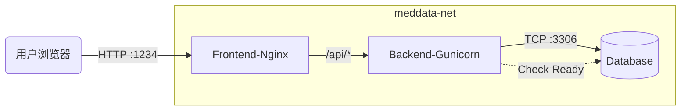

# Docker 容器化架构详解 (Infrastructure as Code)

本文档详细解析了 MedData Hub 项目的 Docker 容器化实现方案。本项目采用 **Docker Compose** 进行多容器编排，实现了前端、后端与数据库的解耦部署与一键拉起。

---

## 1. 整体架构 (Architecture)

系统由三个独立容器组成，通过 Docker 内部网络 (`meddata-net`) 进行通信：

| 服务名称 (Service) | 镜像 (Image) | 内部端口 | 宿主机端口 | 职责 |
| :--- | :--- | :--- | :--- | :--- |
| **frontend** | `nginx:alpine` | 80 | **1234** | 静态资源托管、反向代理 (网关) |
| **backend** | `python:3.9-slim` | 5000 | 5000 (可选) | API 服务、业务逻辑处理 |
| **db** | `mysql:8.0` | 3306 | - | 数据持久化存储 |

### 流量拓扑图


---

## 2. 核心配置文件解析

### 2.1 `docker-compose.yml` (编排文件)
定义了服务间的依赖关系与环境配置

*   **数据库服务 (`db`)**:
    *   **持久化**: 使用 `volumes` 将 MySQL 数据挂载到本地 `db_data`，防止容器删除后数据丢失。
    *   **自动建表**: 将 `meddata_hub.sql` 映射到 `/docker-entrypoint-initdb.d/`，容器首次启动时自动执行 SQL。
*   **后端服务 (`backend`)**:
    *   **依赖等待**: `depends_on: db` 确保数据库容器先启动。
    *   **环境变量**: 通过 `environment` 注入 `DB_HOST=db`，覆盖代码中的 `localhost` 默认值，实现环境解耦。
*   **前端服务 (`frontend`)**:
    *   **构建上下文**: 指定使用 `Dockerfile` (原文件名) 进行多阶段构建。
    *   **端口映射**: `80:1234` 将容器 Web 服务暴露给宿主机。

### 2.2 `frontend.Dockerfile` (前端构建)
采用 **多阶段构建 (Multi-stage Build)** 策略，显著减小镜像体积。

1.  **构建阶段 (Build Stage)**:
    *   基于 `node:20-alpine`。
    *   执行 `yarn install` 和 `yarn build`。
    *   产出 `dist/` 静态文件包。
2.  **生产阶段 (Production Stage)**:
    *   基于 `nginx:alpine` (仅约 20MB)。
    *   **只复制** 构建阶段产出的 `dist` 文件，丢弃庞大的 `node_modules`。
    *   复制自定义 `nginx.conf` 覆盖默认配置。

### 2.3 `nginx.conf` (反向代理网关)
解决了前后端分离架构中常见的 **CORS (跨域)** 问题。

```nginx
server {
    listen 80;

    # 1. 静态资源托管
    location / {
        root /usr/share/nginx/html;
        try_files $uri $uri/ /index.html; # 支持 React Router 的 History 模式
    }

    # 2. API 反向代理
    location /api/ {
        # 将前端发往 /api 的请求转发给内部的 backend 容器
        proxy_pass http://backend:5000; 
    }
}
```

### 2.4 `backend/entrypoint.sh` (启动脚本)
解决了 **“Race Condition” (竞态条件)** 问题：即数据库容器启动了，但 MySQL 服务还没准备好连接，导致后端报错退出。

*   **功能**:
    1.  **Wait-for-it**: 循环检测 MySQL 端口是否通畅。
    2.  **自动初始化**: 检测到数据库为空时，自动调用 `insert_data.py` 插入演示数据。
    3.  **启动应用**: 最后才启动 Gunicorn 服务器。

---

## 3. 环境变量适配策略 (Environment Variables)

为了让代码既能在本地 (`python run.py`) 运行，又能在 Docker 中运行，采用了 **优先级读取策略**：

**Python 代码示例 (`db.py`):**
```python
# 优先读环境变量 (Docker模式)，读不到则用默认值 (本地模式)
"host": os.getenv("DB_HOST", "localhost")
```

| 变量名 | 本地默认值 | Docker 值 | 作用 |
| :--- | :--- | :--- | :--- |
| `DB_HOST` | `localhost` | `db` | 数据库主机地址 |
| `DB_USER` | `root` | `root` | 数据库用户名 |

---

## 4. 开发与生产环境差异

| 特性 | 本地开发 (Local Dev) | 生产部署 (Docker Prod) |
| :--- | :--- | :--- |
| **前端服务器** | Vite Dev Server (HMR) | Nginx (Static) |
| **API 转发** | Vite Proxy (`vite.config.ts`) | Nginx Reverse Proxy (`nginx.conf`) |
| **后端服务器** | Flask Development Server | Gunicorn (WSGI, 多 Worker) |
| **API 地址** | `/api` (转发至 localhost:5000) | `/api` (转发至 backend:5000) |

---

## 5. 常用运维命令

```bash
# 1. 后台启动所有服务
docker compose up -d

# 2. 强制重新构建 (当修改了代码或 Dockerfile)
docker compose up -d --build

# 3. 查看实时日志 (排查错位)
docker compose logs -f

# 4. 手动执行容器内命令 (如插入数据)
docker exec -it meddata-api python insert_data_python/insert_data.py

# 5. 彻底重置 (删除容器与数据卷)
docker compose down -v
```