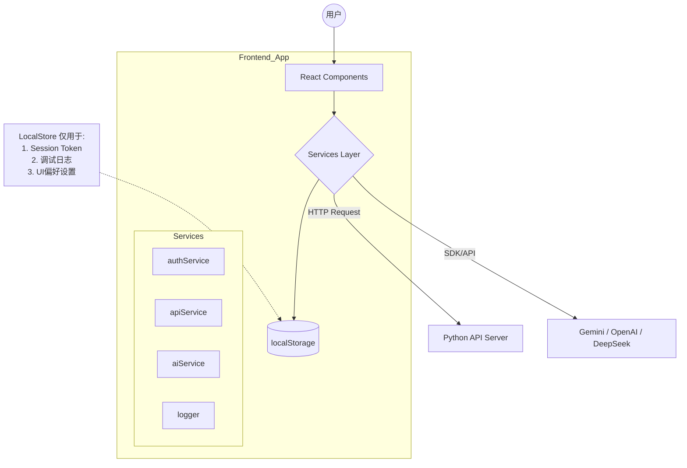
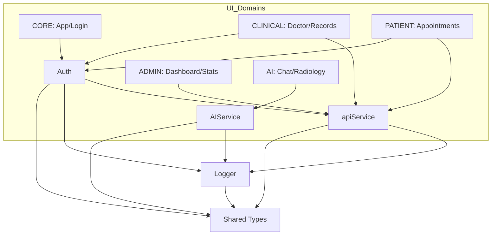

# MedData Hub - 前端架构设计总纲 (System Architecture)

本文档描述了 MedData Hub 前端项目的顶层架构设计、技术选型以及核心设计模式。

> **详细子文档导航**：
> *   **逻辑层细节**：请查阅 [核心服务逻辑 (Services Logic)](./SERVICES_LOGIC.md)
> *   **UI 组件细节**：请查阅 `docs/FRONTEND/ui/` 目录下对应的业务文档。

---

## 1. 技术栈概览 (Tech Stack)

本项目基于现代 React 生态构建，强调高性能、类型安全与开发体验。

| 领域 | 选型 | 说明 |
| :--- | :--- | :--- |
| **核心框架** | **React 19** | 利用最新的 Hooks、Concurrent Mode 与并发特性。 |
| **开发语言** | **TypeScript 5.x** | 全局强类型约束，提升代码健壮性与重构安全性。 |
| **构建工具** | **Vite** | 提供极速的冷启动（HMR）与优化的生产环境打包。 |
| **路由管理** | **React Router v6** | 实现单页应用（SPA）的客户端路由与导航守卫。 |
| **样式方案** | **Tailwind CSS** | 原子化 CSS 框架，快速构建响应式界面。 |
| **图标库** | **Lucide React** | 统一风格的 SVG 图标组件。 |
| **图表可视化** | **Recharts** | 基于 React 组件的声明式图表库，用于数据大屏。 |
| **AI 集成** | **Google GenAI SDK** | 用于直接与 Gemini 模型交互，另支持 Fetch 调用 OpenAI 格式接口。 |

---

## 2. 系统设计模式 (Design Patterns)

本项目采用了三种核心设计模式来应对业务需求：

### 2.1 适配器模式 (Adapter Pattern) - AI 网关
为了屏蔽不同 AI 厂商（Google Gemini, OpenAI, DeepSeek）的接口差异，系统在 `aiService.ts` 实现了适配器层。
*   **统一接口**：UI 组件只需调用标准的 `chatWithAI(prompt, context)` 或 `analyzeImage(file)`。
*   **内部实现**：Service 层根据配置，自动选择调用 Google SDK 还是标准的 REST API，并处理参数格式转换。

### 2.2 客户端聚合模式 (Client-side Aggregation)
由于后端 API 遵循 RESTful 资源分离原则（如 `/patients`, `/records`, `/doctors` 分离），前端 `apiService` 承担了部分数据聚合职责。
*   **示例**：在获取“完整患者详情”时，前端并行请求病历、处方明细和药品列表，并在客户端进行 ID 匹配和组装，减少后端定制化接口的压力。

### 2.3 基于角色的访问控制 (RBAC)
安全架构基于三种角色：**Patient (患者)**、**Doctor (医生)**、**Admin (管理员)**。
*   **路由守卫**：高阶组件 `RequireAuth` 拦截所有路由跳转，验证 Session 有效性及角色权限。
*   **动态菜单**：侧边栏 (`Layout`) 根据当前用户角色动态渲染可见菜单项。

---

## 3. 前端目录结构说明 (Directory Structure)

项目遵循功能模块化与分层架构原则：

```text
meddata_hub/src
├── components/              # UI 展示层 (按业务拆分)
│   ├── ...                  # 具体业务组件 (详见 docs/ui/*.md)
├── services/                # 核心业务逻辑层
│   ├── apiService.ts        # HTTP 请求客户端与数据聚合 (API Client)
│   ├── authService.ts       # 认证与 Session 管理
│   ├── aiService.ts         # AI 模型适配器 (Gemini/OpenAI)
│   └── logger.ts            # 本地日志系统 (用于调试与审计)
├── App.tsx                  # 根组件 (路由配置、全局 Context)
├── index.tsx                # 应用入口 (DOM 挂载、样式引入)
└── types.ts                 # 全局 TypeScript 类型定义 (Interfaces/Types)
```

---

## 4. 数据流向与依赖关系 (Data Flow)

### 4.1 系统上下文交互图
前端作为纯粹的展示与交互层，数据完全依赖后端 API。



### 4.2 模块依赖关系图
展示了主要模块之间的层级调用关系：



---

## 5. 核心工作流时序 (Core Workflows)

### 5.1 启动与健康检查
1.  应用启动 (`index.tsx` -> `App.tsx`)。
2.  `Layout` 组件挂载。
3.  调用 `apiService.checkBackendHealth()`。
    *   **Success**: 设置全局状态为 `Online`，Header 显示绿灯。
    *   **Fail**: 设置全局状态为 `Offline`，Header 显示红灯并提示用户检查后端连接。

### 5.2 诊疗事务提交 (Example Transaction)
以医生提交病历为例，展示前端如何处理复杂事务：
1.  **UI 层 (`DoctorConsultation`)**: 收集表单数据 + 暂存处方列表。
2.  **调用**: `apiService.saveMedicalRecord(record, prescriptions)`。
3.  **Service 层**:
    *   构建复合 Payload (包含 Record 和 Details)。
    *   发送 `POST /api/records` 请求。
    *   **成功**: 记录成功日志，返回 Promise.resolve。
    *   **失败**: 捕获 HTTP 错误，记录 Error 日志，**直接抛出异常**供 UI 层捕获。
4.  **UI 层**: 
    *   **Success**: 清空表单，刷新队列，显示成功 Toast。
    *   **Error**: 保持表单状态，显示错误提示 Toast。


